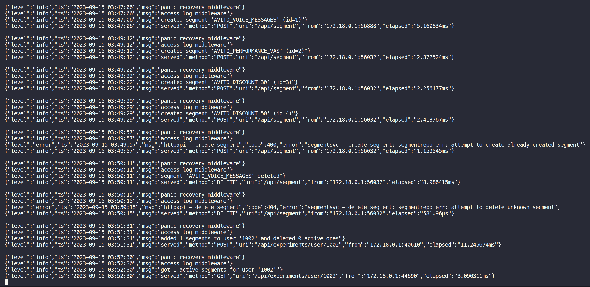
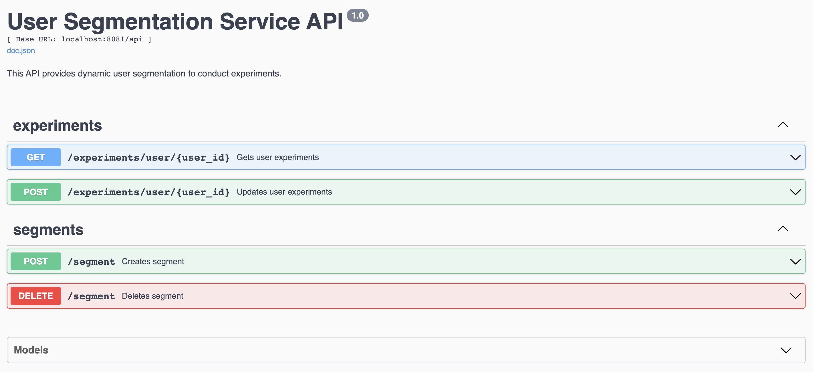
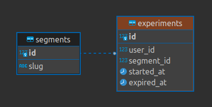

# Сервис динамического сегментирования пользователей

## Описание задачи

Требуется реализовать сервис, хранящий пользователя и сегменты, в которых он состоит (создание, изменение, удаление сегментов, а также добавление и удаление пользователей в сегмент).

Допустим аналитики создали сегменты:
- AVITO_VOICE_MESSAGES
- AVITO_PERFORMANCE_VAS
- AVITO_DISCOUNT_30
- AVITO_DISCOUNT_50

и добавили созданные сегменты нескольким пользователям:

| Пользователь | Сегменты, которым он принадлежит |
| --- | --- |
| 1000 | [AVITO_VOICE_MESSAGES, AVITO_PERFORMANCE_VAS, AVITO_DISCOUNT_30] |
| 1002 | [AVITO_VOICE_MESSAGES, AVITO_DISCOUNT_50] |
| 1004 | нет сегментов |

Теперь мы хотим через API сервиса по user_id получать список сегментов, в которых он состоит:

- Пользователь 1000 состоит в 3 сегментах: AVITO_VOICE_MESSAGES, AVITO_PERFORMANCE_VAS, AVITO_DISCOUNT_30;
- Пользователь 1002 состоит в 2 сегментах: AVITO_VOICE_MESSAGES, AVITO_DISCOUNT_50;
- Пользователь 1004 не состоит ни в одном из сегментов.

## Стек технологий

- Go 1.20
    - Standard Project Layout
    - Clean Architecture (handler -> service -> repository)
- PostgreSQL 15
    - jackc/pgx/pgxpool
    - georgysavva/scany/pgxscan
- Tests: unit and e2e
    - go.uber.org/mock/gomock
    - net/http/httptest
- REST API (at least attempt to)
    - gorilla/mux
- Docker Containerization
- CI with Github Actions
- Conventional Commits :sparkles:

## Запуск приложения

Для запуска требуются docker и make.

Достаточно выполнить в корне проекта:
```
make
```

Настоятельно рекомендуется по окончании выполнить:
```
make compose down
```

Примерно так выглядит работа сервиса на деле:



## Запуск тестов

Unit-тесты:
```
make test
```

Также, после запуска приложения можно прогнать e2e тесты (curl-запросы c проверкой логики API).

Для POSIX окружения (Mac OS):
```
chmod +x ./e2e/*.sh
xattr -rd com.apple.quarantine ./e2e
./e2e/experiments_posix.sh
```

Для систем Linux:
```
chmod +x ./e2e/*.sh
./e2e/experiments_linux.sh
```

А также (для любой из вышеперечисленных систем):
```
./e2e/create_segment.sh
./e2e/delete_segment.sh
```

## API: примеры запросов и ответов

Более подробно спецификация API описана в [Swagger-файле](./docs/swagger.json). После запуска приложения пощупать ручки можно по [ссылке](http://localhost:8081/swagger/index.html):



<br>:exclamation:Данное API спроектировано с учетом выполнения основного задания, а также дополнительных заданий 2 и 3.<br/>

### ```POST /api/segment``` — метод создания сегмента

Создать сегмент:
```
curl -X 'POST' 'http://localhost:8081/api/segment' -d \
'{
  "name": "AVITO_VOICE_MESSAGES"
}'
```
```
{
  "result": "created segment 'AVITO_VOICE_MESSAGES' (id=1)"
}
```

C опцией автодобавления в сегмент опредленного процента пользователей:
```
curl -X 'POST' 'http://localhost:8081/api/segment' -d \
'{
  "name": "AVITO_VOICE_MESSAGES",
  "options": {
    "autoadd_percent": 99.9
  }
}'
```
```
{
  "result": "created segment 'AVITO_VOICE_MESSAGES' (id=1) with 999 active users"
}
```

При попытке создать ранее созданный сегмент:
```
{
  "code": 400,
  "error": "attempt to create already created segment"
}
```

При попытке создать сегмент без названия:
```
{
  "code": 400,
  "error": "empty segment name"
}
```

При указании опции с невалидным процентом:
```
{
  "code": 400,
  "error": "autoadd_percent option should be in range [0, 100]"
}
```

### ```DELETE /api/segment``` — метод удаления сегмента

Удалить сегмент:
```
curl -X 'DELETE' 'http://localhost:8081/api/segment' -d \
'{
  "name": "AVITO_VOICE_MESSAGES"
}'
```
```
{
  "result": "segment 'AVITO_VOICE_MESSAGES' deleted"
}
```

При попытке удалить неизвестный или ранее удаленный сегмент:
```
{
  "code": 404,
  "error": "attempt to delete unknown segment"
}
```

При попытке удалить сегмент без названия:
```
{
  "code": 400,
  "error": "empty segment name"
}
```

### ```POST /experiments/user/{user_id}``` — метод добавления пользователя в сегмент

Добавить пользователя в одни сегменты и/или удалить из других:
```
curl -X 'POST' 'http://localhost:8081/api/experiments/user/1234' -d \
'{
  "add_segments": [
    "AVITO_VOICE_MESSAGES",
    "AVITO_DISCOUNT_50"
  ],
  "delete_segments": [
    "AVITO_PERFORMANCE_VAS",
    "AVITO_DISCOUNT_30"
  ]
}'
```
```
{
  "result": "added 2 segments to user '1234' and deleted 2 active ones"
}
```

С опцией автоудаления пользователя из сегментов, в которые он добавляется:
```
curl -X 'POST' 'http://localhost:8081/api/experiments/user/1234' -d \
'{
  "add_segments": [
    "AVITO_VOICE_MESSAGES",
    "AVITO_DISCOUNT_50"
  ],
  "delete_segments": [
    "AVITO_PERFORMANCE_VAS",
    "AVITO_DISCOUNT_30"
  ],
  "options": {
    "deletion_time": "2024-02-24 04:59:59"
  }
}'
```
```
{
  "result": "added 2 segments to user '1234' and deleted 2 active ones"
}
```

При пустом списке как на добавление, так и на удаление:
```
{
  "code": 400,
  "error": "empty experiment update lists, must add or delete at least one segment"
}
```

При попытке добавить пользователя в (или удалить из) несуществующий или ранее удаленный сегмент:
```
{
  "code": 404,
  "error": "attempt to work with unknown segment, create it first"
}
```

При попытке добавить пользователя в (или удалить из) один и тот же сегмент за 1 запрос:
```
{
  "code": 400,
  "error": "add (delete) list contains non-unique segments"
}
```

При попытке добавить пользователя в сегмент, в который он уже добавлен:
```
{
  "code": 400,
  "error": "attempt to add already active segment"
}
```

При попытке удалить пользователя из сегмента, в который он не был добавлен ранее:
```
{
  "code": 400,
  "error": "attempt to delete user's inactive segment"
}
```

При указании опции автоудаления пользователя из сегмента в прошедшем времени:
```
{
  "code": 400,
  "error": "segment deletion time should be in the future"
}
```

### ```GET /experiments/user/{user_id}``` — метод получения активных сегментов пользователя

Получить активные сегменты пользователя:
```
curl -X 'GET' 'http://localhost:8081/api/experiments/user/1234'
```
```
{
  "result": [
    "AVITO_VOICE_MESSAGES",
    "AVITO_DISCOUNT_50"
  ]
}
```

В случае пустого результата:
```
{
  "result": []
}
```

## Схема БД (PostgreSQL)

Полная схема БД описана в [SQL-файле](./.initdb/segmentation.sql). Она же в виде диаграммы:



## Возникшие вопросы

1. Как стоит принимать ID пользователя: через тело запроса или как часть пути URL?
- Согласно приницпам REST и спецификации HTTP, выбор пал на 2ой вариант.

2. Почему метод называется "добавление пользователя в сегмент", имея при этом возможность удалять его из сегментов?
- Честно говоря, ответа на этот вопрос у меня нет.

3. Как в методе добавления пользователя в сегмент обрабатывать частично некорректные запросы?
- В связи с тем, что cегменты пользователя очень важны и что неоходимо аккуратно выполнять действия с ними, было решено заворачивать операции (добавление/удаление пользователя в сегменты/из сегментов) в транзакцию и откатывать её при наличии каких-либо некорректных действий, отдавая в ответ сообщение об имеющейся ошибке. Пытаетесь добавить пользователя в неизвестный сегмент или сегмент, в который он был добавлен ранее, — получите соответствующую ошибку; пытаетесь добавить пользователя в сегмент более 1ого раза за запрос — получите соответствующую ошибку (аналогично с удалением). Это хорошая практика, которая поможет выявить опечатки/баги в запросах.

4. В каком порядке выполнять действия в методе добавления пользователя в сегмент? И что делать, если списки на добавление и удаление пересекаются?
- Было бы странно добавлять пользователя в сегмент и сразу же его удалять из него. Поэтому решено сначала удалять пользователя из сегментов, а после уже добавлять. В случае пересечения списков на добавление и удаление, логика не меняется — это особенно полезно, когда нужно поменять время удаления пользователя из сегмента (доп. задание 2).

5. Откуда брать пользователей, которые будут автоматически добавлены в созданный нами сегмент? (доп. задание 3)
- Довольно странно брать пользователей из таблицы с сегментами и добавленными в них пользователями. Поэтому было решено завести таблицу с пользователями и брать данные уже из неё, но считать, что не наш сервис занимается данными и работой с пользователями (их созданием, удалением, валидацией и т. п.). Для имитации существования пользователей в данной таблице был создан триггер, который заполняет её пользователями из запросов на добавление последних в сегменты.